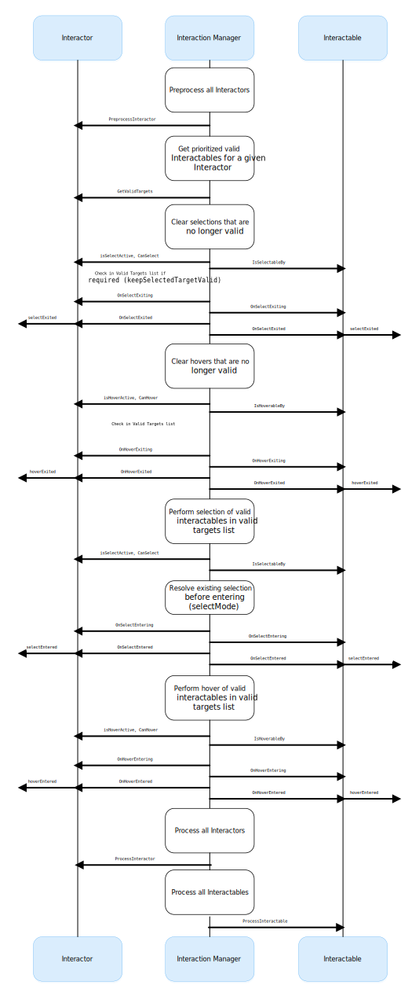

# Architecture

This section describes the relationship between the core components of the interaction system and the states that make up the lifecycle of an interaction.

## States

The Interaction system has three common states: Hover, Select, and Activate. These states can mean different things to different objects. Hover and Select are loosely related to the traditional GUI concepts of mouse-over and mouse-down. Activate is specific to XR and is a contextual command.

These interaction states always involve both an [Interactor](#interactors) and [Interactable](#interactables), and both are notified upon entering or exiting the state.

| State | Function |
| - | - |
| **Hover** | If an Interactable is a valid target for the Interactor its state changes to Hover. Hovering on an object signifies an intention to interact with it, but doesn't typically change the behavior of that object, though it might create a visual indicator for this change of state, like how a hovered button changes tint. |
| **Select** | Selection requires an action such as a button or trigger press from the user to enable the Select state. When an Interactable is in the Select state, Unity considers the selecting Interactor to be interacting with it. For example, Selection can simulate picking up a grabbable object, holding a lever, or preparing to push a door that has focus via hovering. |
| **Activate** | Activation is an extra action, typically mapped to a button or trigger that affects the currently selected object. This lets the user further interact with an object they've selected. The Activate action depends on the Interactable. For example, you can use Activate to toggle a grabbable flashlight on/off or shoot a ball launcher. You can hook the component to process Activate into an action without any additional code by hooking an existing callback using the Inspector window under **Interactable Events** and then add to **Activated** via UnityEvents. |

## Components

### Interactors
Interactor components handle the actions of hovering and selecting Interactable objects in the world. This component is responsible for creating a list of Interactables (called Valid Target) that it could potentially hover or select each frame. The Valid Target list is sorted by priority, and by default the closest Interactables have highest priority. This priority criteria can be changed or extended using [Target filters](target-filters.md).

### Interactables
Interactables are objects in a scene that an Interactor can hover, select, and/or activate. This component is responsible for defining the behavior of those interaction states. The same Interactor might be able to pick up and throw a ball, shoot a gun, or press a 3D button on a keypad.

### Interaction Manager
The Interaction Manager acts as an intermediary between Interactors and Interactables. This component is responsible for actually causing the interaction state changes among its group of registered Interactors and Interactables.

The typical setup is to have a single Interaction Manager, where all Interactables can potentially be affected by all Interactors. You can have multiple complementary Interaction Managers, each with their own set of Interactors and Interactables, and turn them on and off to enable or disable sets of interaction. The collection of loaded scenes needs to have at least one Interaction Manager for interactions to work.

Upon being enabled (during the behavior's `OnEnable`), both Interactors and Interactables register with an Interaction Manager automatically. They will use the first found Interaction Manager if you don't specify one in the Inspector window. Upon being disabled (during the behavior's `OnDisable`), both Interactors and Interactables unregister from the Interaction Manager they are registered with.

For more detail about the exact mechanism the Interaction Manager uses to trigger the state changes, see [Update loop](#update-loop).

### Controllers
The XR Controller component provides a way to abstract input data, which Interactors then use to translate into interaction states, notably for selection and activation. The input actions are bound to a tracked device's controls and are read from each frame, which Interactors then query to determine if they should select or activate.

When there are multiple Interactors associated with a hand, it is typical for there to also be multiple XR Controller components also associated with that same hand. In other words, you do not need to only have a single XR Controller component to represent all interactors for a hand. For example, you may want different inputs to be used for a ray-based teleportation interactor and a close range direct interactor for grabbing, and both Interactor components can reference different XR Controller components to read different input values from the same tracked controller device.

This component is also responsible for reading the position and rotation of the tracked device, and applying it to the Transform component.

#### Controller Recorder
You can also use the Controller Recorder component to record and play back input data. You can use this to to test out interactions or run test scenes without an XR device attached.

> [!Note]
> Controller Recorder currently only works in the Unity Editor.

## Update loop

The update loop of the Interaction Manager queries Interactors and Interactables, and handles the hover and selection states. First, it asks Interactors for a valid list of targets (used for both hover and selection). It then checks both Interactors and Interactables to see if their existing hover and selection objects are still valid. After invalid previous states have been cleared (exited via `OnSelectExiting` and `OnSelectExited`/`OnHoverExiting` and `OnHoverExited`), it queries both objects for valid selection and hover states, and the objects enter a new state via `OnSelectEntering` and `OnSelectEntered`/`OnHoverEntering` and `OnHoverEntered`.

All registered Interactables and Interactors are updated before and after interaction state changes by the Interaction Manager explicitly using `PreprocessInteractor`, `ProcessInteractor`, and `ProcessInteractable`. Interactors are always notified before Interactables for both processing and state changes. Interactables and Interactors are not limited from using the normal `MonoBehaviour` `Update` call, but per-frame logic should typically be done in one of the process methods instead so that Interactors are able to update before Interactables.
