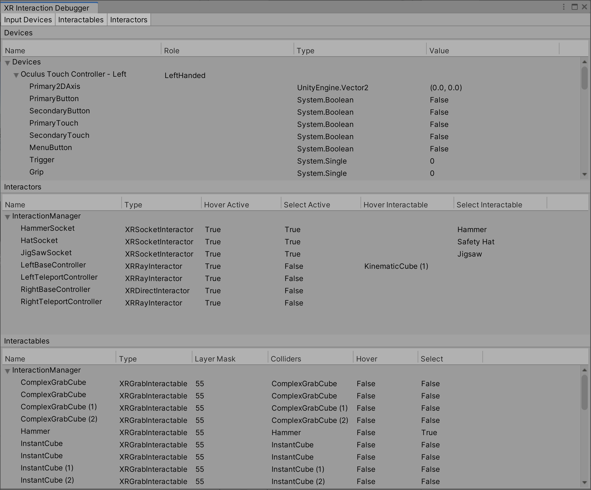
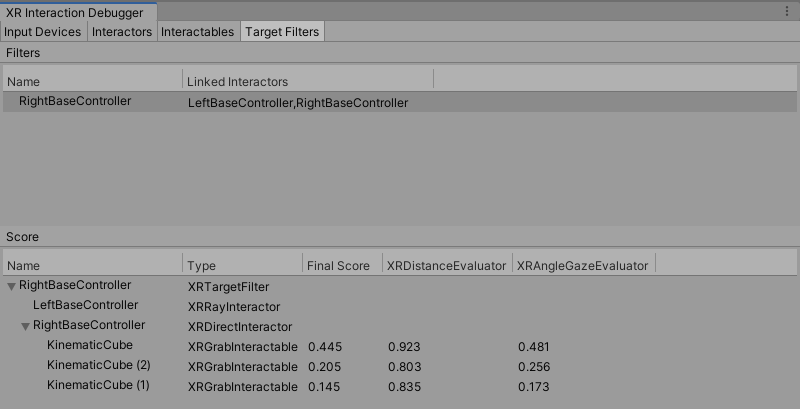

# Debugger window

The XR Interaction Toolkit Debugger window displays a top-down view of all the Input Devices, Interactables, and Interactors in a scene. It also displays their relationship to each other and their parent Interaction Managers. To open this window, go to **Window &gt; Analysis &gt; XR Interaction Debugger** from Unity's main menu.

You must be in Play mode to use this window.

## Target filters

The Target Filters tab displays all active and enabled `XRTargetFilters` in the scene. It also displays the Interactors and `XRTargetFilters` that are linked at the moment.

You can select an `XRTargetFilter` in the Filters tree to inspect its Evaluators' scores in the Score tree. The Score tree displays the final and weighted scores for an Interactable in a Valid Target list. The Interactors are shown as the parent of their respective Valid Target list.

