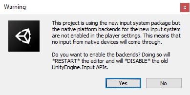
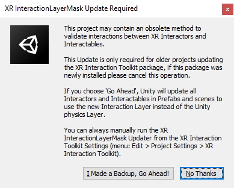

# Installation

To install this package, refer to the instructions that match your Unity Editor version:

## Version 2022.1 and later

To install this package, follow the [installation instructions in the Unity User Manual](https://docs.unity3d.com/Documentation/Manual/upm-ui-install.html).

## Version 2021.3

To install this package, follow the instructions for [adding a package by name](https://docs.unity3d.com/2021.3/Documentation/Manual/upm-ui-quick.html) in the Unity Editor.

|Text Field|Value|
|---|---|
|**Name**|`com.unity.xr.interaction.toolkit`|
|**Version (optional)**|`2.1.0-pre.1`|

## Version 2020.3

To install this package, follow the [installation instructions in the Unity User Manual](https://docs.unity3d.com/2020.3/Documentation/Manual/upm-ui-install.html).

## Version 2019.4 

To install this package, follow the [installation instructions in the Unity User Manual](https://docs.unity3d.com/2019.4/Documentation/Manual/upm-ui-install.html).

## Input System

This package has a dependency on [Input System](https://docs.unity3d.com/Packages/com.unity.inputsystem@1.3/manual/index.html). If that package has not already been installed, Unity will automatically add it to your Project. You might see a prompt asking you to enable input backends. Click **Yes** to accept it. For more information, see [Enabling the new input backends](https://docs.unity3d.com/Packages/com.unity.inputsystem@1.3/manual/Installation.html#enabling-the-new-input-backends) in the Input System package documentation.

## Interaction Layer Mask Updater

You will see a prompt asking you to upgrade your interaction layers in your project assets. If you're installing the XR Interaction Toolkit for the first time in your project, click **No Thanks** to skip. If you are upgrading from an older package version prior to 2.0.0, then it's recommended to update the interaction layer masks by clicking **I Made a Backup, Go Ahead!**. For more information, see [Interaction Layer Mask Updater](interaction-layers.md#interaction-layer-mask-updater).

# Installing samples

The package comes with a number of samples, including a Starter Assets sample which contains a recommended set of input actions, controller bindings, and presets. You can install these directly from the Package Manager (from Unity's main menu, go to **Window &gt; Package Manager**). Select the XR Interaction Toolkit package, then click **Import** next to a sample to copy it into the current project.

For more details about samples, see the [Samples](samples.md) page.
