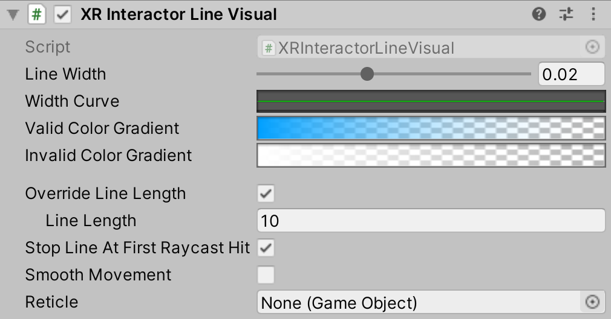

# XR Interactor Line Visual

Interactor helper object aligns a `LineRenderer` with the Interactor.

| **Property** | **Description** |
|--|--|
| **Line Width** | Controls the width of the line. |
| **Width Curve** | Controls the relative width of the line from start to end. |
| **Valid Color Gradient** | Controls the color of the line as a gradient from start to end to indicate a valid state. |
| **Invalid Color Gradient** | Controls the color of the line as a gradient from start to end to indicate an invalid state. |
| **Override Line Length** | A boolean value that controls which source Unity uses to determine the length of the line. Set to `true` to use the Line Length set by this behavior. Set to `false` to have the length of the line determined by the Interactor. |
| **Line Length** | Controls the length of the line when overriding (the above checkbox must be enabled for this to be used). |
| **Stop Line At First Raycast Hit** | Controls whether this behavior always cuts the line short at the first ray cast hit, even when invalid. The line will always be cut short by this behavior when pointing at a valid target. - `true` means to do the same even when pointing at an invalid target. - `false` means the line will continue to the configured line length. |
| **Smooth Movement** | Controls whether the rendered segments will be delayed from and smoothly follow the target segments. |
| **Reticle** | Stores the reticle that appears at the end of the line when it is valid. |
