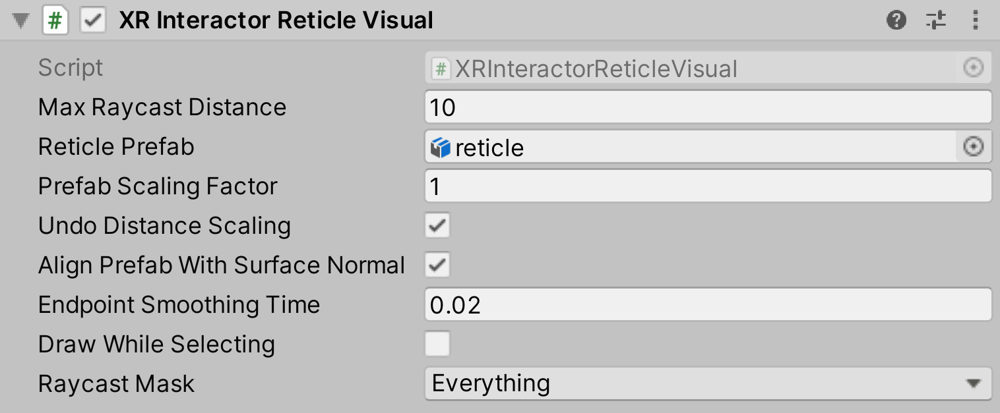

# XR Interactor Reticle Visual

Interactor helper object that draws a targeting **Reticle Prefab** over a ray casted point in front of the Interactor.

| **Property** | **Description** |
|--|--|
| **Max Raycast Distance** | The max distance to ray cast from this Interactor. |
| **Reticle Prefab** | Prefab which Unity draws over ray cast destination. |
| **Prefab Scaling Factor** | Amount to scale prefab (before applying distance scaling). |
| **Undo Distance Scaling** | Enable to have Unity undo the apparent scale of the prefab by distance. |
| **Align Prefab with Surface Normal** | Enable to have Unity align the prefab to the ray cast surface normal. |
| **Endpoint Smoothing Time** | Smoothing time for endpoint. |
| **Draw While Selecting** | Enable to have Unity draw the **Reticle Prefab** while selecting an Interactable. |
| **Raycast Mask** | Layer mask for Raycast. |
