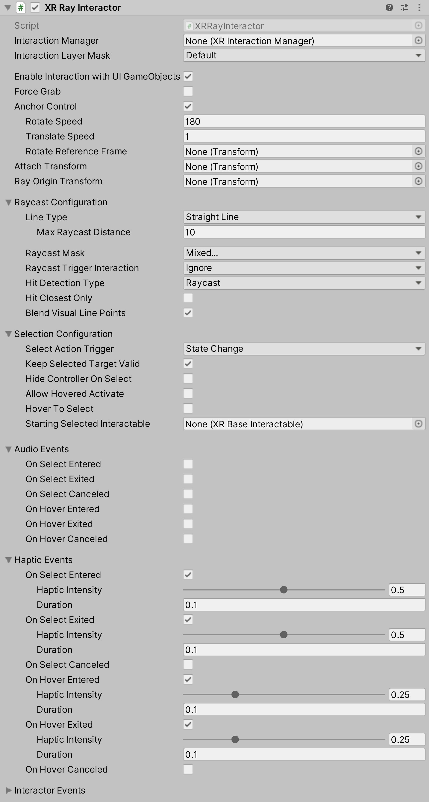

# XR Ray Interactor

Interactor used for interacting with Interactables at a distance. This is handled via ray casts that update the current set of valid targets for this interactor.

| **Property** | **Description** |
|--|--|
| **Interaction Manager** | The [XRInteractionManager](xr-interaction-manager.md) that this Interactor will communicate with (will find one if **None**). |
| **Interaction Layer Mask** | Allows interaction with Interactables whose [Interaction Layer Mask](interaction-layers.md) overlaps with any Layer in this Interaction Layer Mask. |
| **Enable Interaction with UI GameObjects** | Enable to allow this Interactor to affect UI. |
| **Force Grab** | Force grab moves the object to your hand rather than interacting with it at a distance. |
| **Anchor Control** | Allows the user to move the attach anchor point using the joystick. |
| **Rotate Speed** | Only used and displayed in **Anchor Control** is enabled. Speed that the anchor is rotated. |
| **Translate Speed** | Only used and displayed in **Anchor Control** is enabled. Speed that the anchor is translated. |
| **Rotate Reference Frame** | Only used and displayed in **Anchor Control** is enabled. The optional reference frame to define the up axis when rotating the attach anchor point. When not set, rotates about the local up axis of the attach transform. |
| **Attach Transform** | The `Transform` that is used as the attach point for Interactables. Automatically instantiated and set in `Awake` if **None**. Setting this will not automatically destroy the previous object. |
| **Ray Origin Transform** | The starting position and direction of any ray casts. Automatically instantiated and set in `Awake` if **None** and initialized with the pose of the `XRBaseInteractor.attachTransform`. Setting this will not automatically destroy the previous object. |
| **Line Type** | The type of ray cast. |
| &emsp;Straight Line | Set **Line Type** to **Straight Line** to perform a single ray cast into the scene with a set ray length. |
| &emsp;Projectile Curve | Set **Line Type** to **Projectile Curve** to sample the trajectory of a projectile to generate a projectile curve. |
| &emsp;Bezier Curve | Set **Line Type** to **Bezier Curve** to use a control point and an end point to create a quadratic Bezier curve. |
| &emsp;Max Raycast Distance| Only used and displayed if **Line Type** is **Straight Line**. Increasing this value will make the line reach further. |
| **Reference Frame** | Only used and displayed if **Line Type** is either **Projectile Curve** or **Bezier Curve**. The reference frame of the curve to define the ground plane and up. If not set at startup it will try to find the `XROrigin.Origin` `GameObject`, and if that does not exist it will use global up and origin by default. |
| **Velocity** | Only used and displayed if **Line Type** is **Projectile Curve**. Initial velocity of the projectile. Increasing this value will make the curve reach further. |
| **Acceleration** | Only used and displayed if **Line Type** is **Projectile Curve**. Gravity of the projectile in the reference frame. |
| **Additional Ground Height** | Only used and displayed if **Line Type** is **Projectile Curve**. Additional height below ground level that the projectile will continue to. Increasing this value will make the end point drop lower in height. |
| **Additional Flight Time** | Only used and displayed if **Line Type** is **Projectile Curve**. Additional flight time after the projectile lands at the adjusted ground level. Increasing this value will make the end point drop lower in height. |
| **Sample Frequency** | Only used and displayed if **Line Type** is **Projectile Curve** or **Bezier Curve**. The number of sample points Unity uses to approximate curved paths. Larger values produce a better quality approximate at the cost of reduced performance due to the number of ray casts. A value of `n` will result in `n - 1` line segments for ray casting. This property is not used when using a **Line Type** of **Straight Line** since the effective value would always be 2. |
| **End Point Distance** | Only used and displayed if **Line Type** is **Bezier Curve**. Increase this value distance to make the end of the curve further from the start point. |
| **End Point Height** | Only used and displayed if **Line Type** is **Bezier Curve**. Decrease this value to make the end of the curve drop lower relative to the start point. |
| **Control Point Distance** | Only used and displayed if **Line Type** is **Bezier Curve**. Increase this value to make the peak of the curve further from the start point. |
| **Control Point Height** | Only used and displayed if **Line Type** is **Bezier Curve**. Increase this value to make the peak of the curve higher relative to the start point. |
| **Raycast Mask** | The layer mask used for limiting ray cast targets. |
| **Raycast Trigger Interaction** | The type of interaction with trigger volumes via ray cast. |
| **Hit Detection Type** | Which type of hit detection to use for the ray cast. |
| &emsp;Raycast | Set **Hit Detection Type** to **Raycast** to use `Physics` Raycast to detect collisions. |
| &emsp;Sphere Cast | Set **Hit Detection Type** to **Sphere Cast** to use `Physics` Sphere Cast to detect collisions. |
| **Hit Closest Only** | Whether Unity considers only the closest Interactable as a valid target for interaction. Enable this to make only the closest Interactable receive hover events. Otherwise, all hit Interactables will be considered valid and this Interactor will multi-hover. |
| **Blend Visual Line Points** | Blend the line sample points Unity uses for ray casting with the current pose of the controller. Use this to make the line visual stay connected with the controller instead of lagging behind. When the controller is configured to sample tracking input directly before rendering to reduce input latency, the controller may be in a new position or rotation relative to the starting point of the sample curve used for ray casting. A value of `false` will make the line visual stay at a fixed reference frame rather than bending or curving towards the end of the ray cast line. |
| **Select Action Trigger** | Choose how Unity interprets the select input action from the controller. Controls between different input styles for determining if this Interactor can select, such as whether the button is currently pressed or just toggles the active state. |
| **Keep Selected Target Valid** | Whether to keep selecting an Interactable after initially selecting it even when it is no longer a valid target. Enable to make the `XRInteractionManager` retain the selection even if the Interactable is not contained within the list of valid targets. Disable to make the Interaction Manager clear the selection if it isn't within the list of valid targets. A common use for disabling this is for Ray Interactors used for teleportation to make the teleportation Interactable no longer selected when not currently pointing at it. |
| **Hide Controller On Select** | Controls whether this Interactor should hide the controller model on selection. |
| **Allow Hovered Activate** | Controls whether to send activate and deactivate events to interactables that this interactor is hovered over but not selected when there is no current selection. By default, the interactor will only send activate and deactivate events to interactables that it's selected. |
| **Hover To Select** | Enable to have Interactor automatically select an Interactable after hovering over it for a period of time. |
| **Starting Selected Interactable** | The Interactable that this Interactor automatically selects at startup (optional, may be **None**). |
| **Audio Events** | These tie into the same selection and hover events as the **Interactor Events** further below - these audio events provide a convenient way to play specified audio clips for any of those events you want. |
| &emsp;On Select Entered | If enabled, the Unity editor will display UI for supplying the audio clip to play when this Interactor begins selecting an Interactable. |
| &emsp;On Select Exited | If enabled, the Unity editor will display UI for supplying the audio clip to play when this Interactor successfully exits selection of an Interactable. |
| &emsp;On Select Canceled | If enabled, the Unity editor will display UI for supplying the audio clip to play when this Interactor cancels selection of an Interactable. |
| &emsp;On Hover Entered | If enabled, the Unity editor will display UI for supplying the audio clip to play when this Interactor begins hovering over an Interactable. |
| &emsp;On Hover Exited | If enabled, the Unity editor will display UI for supplying the audio clip to play when this Interactor successfully ends hovering over an Interactable. |
| &emsp;On Hover Canceled | If enabled, the Unity editor will display UI for supplying the audio clip to play when this Interactor cancels hovering over an Interactable. |
| **Haptic Events** | These tie into the same selection and hover events as the **Interactor Events** further below - these haptic events provide a convenient way to provide haptic feedback for any of those events you want. |
| &emsp;On Select Entered | If enabled, the Unity editor will display UI for supplying the duration (in seconds) and intensity (normalized) to play in haptic feedback when this Interactor begins selecting an Interactable. |
| &emsp;On Select Exited | If enabled, the Unity editor will display UI for supplying the duration (in seconds) and intensity (normalized) to play in haptic feedback when this Interactor successfully exits selection of an Interactable. |
| &emsp;On Select Canceled | If enabled, the Unity editor will display UI for supplying the duration (in seconds) and intensity (normalized) to play in haptic feedback when this Interactor cancels selection of an Interactable. |
| &emsp;On Hover Entered | If enabled, the Unity editor will display UI for supplying the duration (in seconds) and intensity (normalized) to play in haptic feedback when this Interactor begins hovering over an Interactable. |
| &emsp;On Hover Exited | If enabled, the Unity editor will display UI for supplying the duration (in seconds) and intensity (normalized) to play in haptic feedback when this Interactor successfully ends hovering over an Interactable. |
| &emsp;On Hover Canceled | If enabled, the Unity editor will display UI for supplying the duration (in seconds) and intensity (normalized) to play in haptic feedback when this Interactor cancels hovering over an Interactable. |
| **Interactor Events** | See the [Interactor Events](interactor-events.md) page. |
